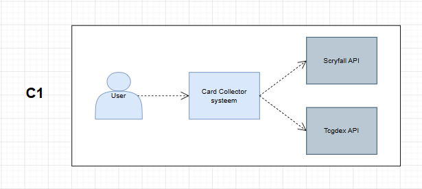

# C1 - Context Diagram

The context diagram provides a high-level overview of the Card Collector system and its external actors.

## Purpose

This layer shows:

- Primary users
- External systems
- System boundaries

## Diagram

## Description

The user interacts with the Card Collector system to manage and view trading card collections.

External APIs are used to retrieve card information:

- Scryfall API
- TCGDex API

These systems exist outside the application boundary.