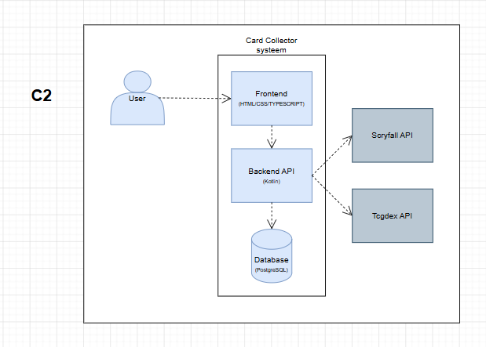

# C2 - Container Diagram

The container diagram describes the major containers inside the Card Collector system.

## Diagram

## Containers

### Frontend

Handles user interaction and communicates with the backend API.

### Backend API

Processes requests, business logic, security, and integrations.

### Database

Stores:

- users
- cards
- user collections/ cards

### External APIs

The backend integrates with:

- Scryfall API
- TCGDex API