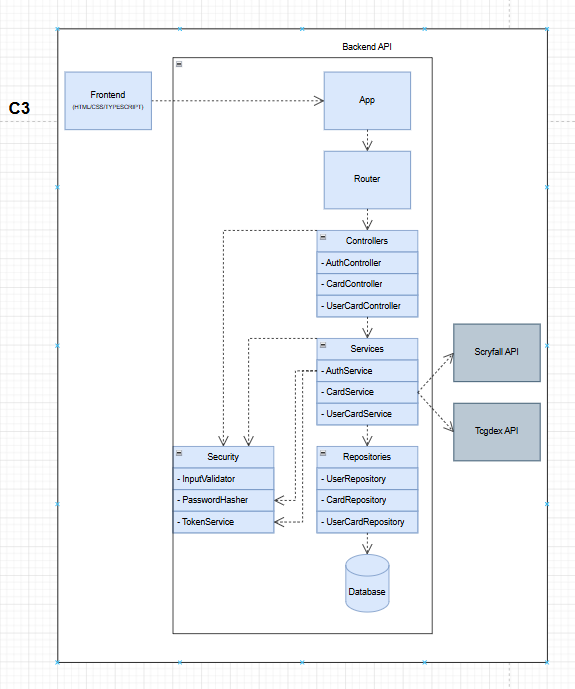

# C3 - Component Diagram

The component diagram shows the internal backend architecture.

## Diagram

## Components

### Controllers

Handle incoming requests.

### Services

Contain business logic.

### Repositories

Handle data persistence.

### Security

Responsible for:

- password hashing
- token generation
- validation

### External API Clients

Integrate external card APIs.