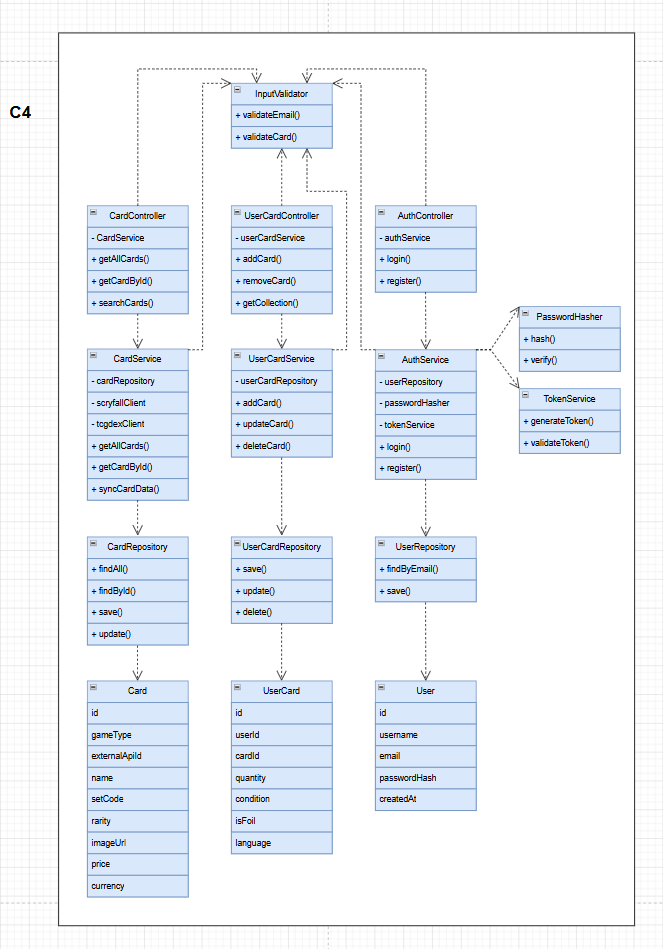

# C4 - Code Diagram

The code diagram provides a detailed overview of backend classes and relationships.

## Diagram



## Structure

The backend follows a layered architecture:

```txt
Controller
↓
Service
↓
Repository
↓
Model